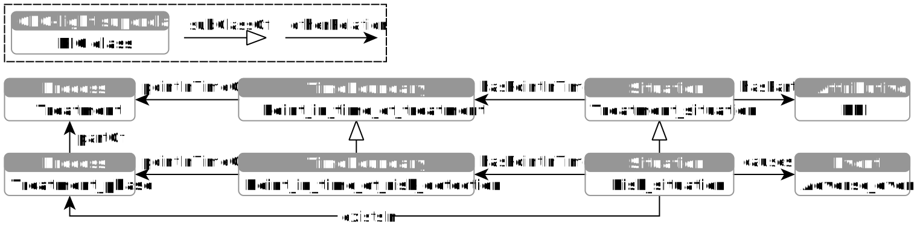

# Risk Identification Ontology (RIO)

Critical situations in hospitals arise especially during interdisciplinary cooperation and the use of complex medical technology, for example during surgical procedures or in the perioperative area. In particular, overlooking medically relevant treatment data or an incomplete medical history can lead to incorrect treatment. Within the OntoMedRisk project (funded by the [German Federal Ministry of Education and Research](https://www.bmbf.de)), methods and tools were developed to identify and analyse risks in perioperative processes. The developed software suite is based on the Risk Identification Ontology (RIO), which provides a framework for risk specification and reasoning. RIO utilises the ontological model of the risk notion defined in the [publication](#publication) and is founded on the [General Formal Ontology (GFO)](https://github.com/Onto-Med/GFO).

The starting point of the modelling is the treatment process, which may consist of different treatment phases (*gfo:has_part*). The whole treatment as well as the phases are complex processes (*gfo:Situoid*). The treatment has (*gfo:projects_to*) a temporal extension, the treatment time (*gfo:Chronoid*). At each point in time (*gfo:Time_boundary*) of the treatment, exactly one treatment situation (*gfo:Situation*) exists (*gfo:exists_at*). A point in time of the treatment is a boundary of the treatment time (*gfo:boundary_of*), whereas the corresponding treatment situation is a boundary of the treatment itself. For each treatment phase, specific points in time of risk detection can be defined. The treatment situations existing at these points in time are analysed for the presence of risks. Such situations are called potential risk situations because they do not necessarily contain risks. Situations, and in particular treatment situations, possess different properties (*gfo:Property*). In the context of risk identification, these properties are called Key Performance Indicators (KPI). They can belong to the situation itself, but also to the participants, such as doctors, medical instruments and patients. Such properties are also considered properties of the current treatment situation (*gfo:has_property*). According to the definitions in the [publication](#publication), a particular combination of properties (a composite property) of a potential risk situation (e.g., patient age = 3 months, meningitis vaccination = false and antibiotic prevention = false) may indicate a risk, i.e., could lead to an adverse situation.

## Founding RIO with GFO-light

The current version of RIO, is founded with the new lightweight version of GFO, called GFO-light (see [GFO repository](https://github.com/Onto-Med/GFO)), which is designed as a framework for the efficient development and foundation of domain/application ontologies. By using GFO-light, some parts of RIO could be simplified, i.e., modelled with fewer entities (classes, properties, individuals).

**Fig. 1.** *RIO - GFO-light embedding (overview)*

The main difference to the [original version of RIO](https://github.com/Onto-Med/RIO/releases/tag/2017-07-24) is a new interpretation of the notion of situation. Whereas in the original RIO, the treatment situations possessed (*gfo:has_property*) some properties (including composite risk properties), i.e., were bearers of properties, a situation in GFO-light (and correspondingly also in the new RIO) is understood as a combination of properties (*gfo-light:attributive*), i.e., a situation consists of (gfo-light:hasPart) attributives. The class *Risk* could be omitted. The individual properties do not have to be encapsulated in composite risk properties, but can be assigned directly to the treatment situation. Each subclass of *Risk_situation* (e.g., *Dura_mater_infection_risk_situation*) represents a risk type by restrictions of the properties determining the risk of this type (e.g., patient age ≤ 5 months, meningitis vaccination = false and antibiotic prevention = false). Potential risk situations containing these properties in the defined ranges are classified automatically as risk situations of corresponding types.

A further simplification is that in GFO-light points in time of a process can be assigned directly to the process itself (see *pointInTimeOf* in **Fig.1**), without a detour via its temporal extension (*gfo:Chronoid*). In addition, some object properties from GFO-light (e.g., *gfo-light:existsIn* and *gfo-light:causes*) could be reused so that it was no longer necessary to define similar properties (*risk_in_phase*, *risk_for_adverse_situation* and *succeeding_situation*) in RIO.

A small example ([examples/rio-example.ttl](examples/rio-example.ttl)) illustrates the identification (reasoning) of risks for a bacterial infection during cochlear implantation in infants. Five KPIs are defined (as subclasses of the class *KPI*), each of which has a subclass with a property restriction (**Tab. 1**). 

<table>
    <tr><th>KPI class</th><th>KPI subclass</th><th>KPI restriction</th></tr>
    <tr><td>Age_in_months</td><td>Age_in_months_l_5</td><td>Age_in_months and (decimalValue some xsd:decimal[>= 0 , < 5])</td></tr>
    <tr><td>Antibiotic_prevention</td><td>Antibiotic_prevention_e_false</td><td>Antibiotic_prevention and (booleanValue value false)</td></tr>
    <tr><td>Ear_structure</td><td>Ear_structure_e_abnormal</td><td>Ear_structure and (stringValue value "abnormal"^^xsd:string)</td></tr>
    <tr><td>Skull_bone_thickness</td><td>Skull_bone_thickness_le_2</td><td>Skull_bone_thickness and (decimalValue some xsd:decimal[>= 0 , <= 2])</td></tr>
    <tr><td>Vaccination</td><td>Vaccination_e_false</td><td>Vaccination and (booleanValue value false)</td></tr>
</table>

**Tab. 1.** *Example KPIs with restrictions*

The class *Dura_mater_infection_risk_situation* (a subclass of *Treatment_situation/Risk_situation*) has the following restriction (risk identification rule):

    (
        (hasPart some Age_in_months_l_5) or 
        (hasPart some Ear_structure_e_abnormal) or 
        (hasPart some Skull_bone_thickness_le_2)
    )
    and (hasPart some Antibiotic_prevention_e_false)
    and (hasPart some Vaccination_e_false)

Situations that fulfil this rule (i.e., required KPIs are within the defined ranges) are automatically classified in the class *Dura_mater_infection_risk_situation* by the reasoner. The treatment situation instance *rs1*, for example, has the assertions shown in the **Tab. 2**, fulfils the risk rule/restriction and is therefore classified in the class *Dura_mater_infection_risk_situation*.

<table>
    <tr><th>Object property assertion</th><th>Data property assertion</th></tr>
    <tr><td>hasPart vaccination_false</td><td>booleanValue false</td></tr>
    <tr><td>hasPart age_4</td><td>decimalValue 4</td></tr>
    <tr><td>hasPart antibiotic_false</td><td>booleanValue false</td></tr>
</table>

**Tab. 2.** *Example instance (rs1) of the class Treatment_situation. In the first column are object property assertions of rs1, in the second column - the data property assertions of the corresponding KPI instance.*

## Publication

> **Uciteli A, Neumann J, Tahar K, Saleh K, Stucke S, Faulbrück-Röhr S, Kaeding A, Specht M, Schmidt T, Neumuth T, Besting A, Stegemann D, Portheine F, Herre H**. Ontology-based specification, identification and analysis of perioperative risks. Journal of Biomedical Semantics. 2017;8:36. https://doi.org/10.1186/s13326-017-0147-8

## See also

* [Project website](http://www.ontomedrisk.de/)
* [Further publications](https://www.uniklinikum-jena.de/gbit/Aufbauorganisation/Anwendungsforschung+/OntoMedRisk.pdf?rewrite_engine=id&no301=1)
* [General Formal Ontology (GFO)](https://github.com/Onto-Med/GFO)
